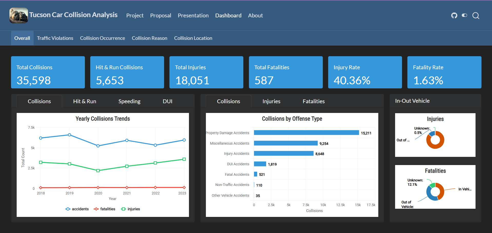
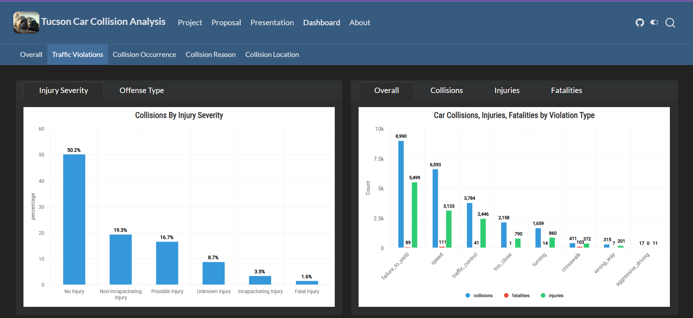
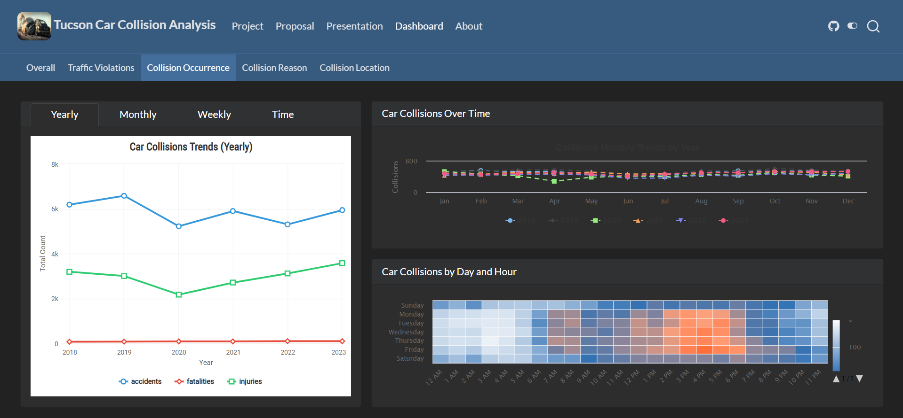
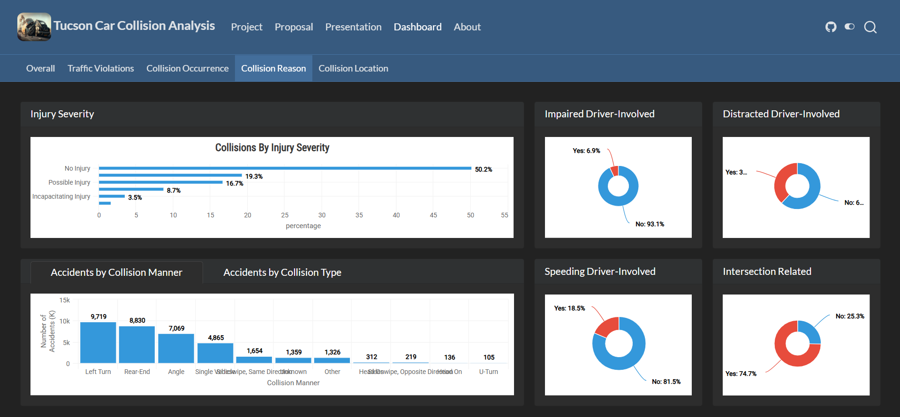
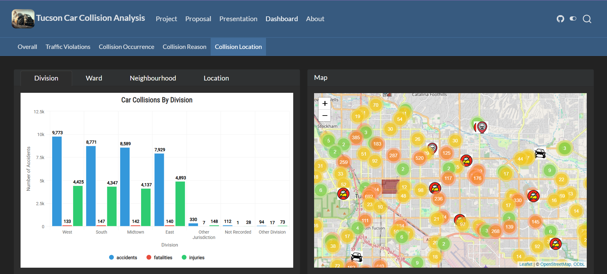

# 🚗 Tucson Car Collision Analysis

**INFO 526 - Data Analysis & Visualization**  
University of Arizona | Spring 2024  
📍 [Live Dashboard](https://info-526-s24.github.io/project-final-DataDazzlers/)


---

## 📌 Introduction

This project delivers an interactive and visually rich dashboard that provides comprehensive insights into traffic collisions in Tucson, AZ. The dashboard is crafted with **Quarto**, using **ggplot2**, **Plotly**, and **Leaflet** for layered data interaction and geographical mapping.

---

## 📂 Dataset

We used public GIS records from the **City of Tucson**, covering traffic collision data from **2018 to 2023** as reported by the Tucson Police Department. The dataset includes:
- Collision type
- Injury & fatality counts
- Violation categories
- Latitude and longitude for spatial mapping

---

## 🎯 Objectives

The primary goal is to provide a **user-friendly analytical dashboard** for understanding accident patterns based on:
- Time (year/month/day/hour)
- Severity (injury/fatality)
- Location (division/ward/neighborhood)
- Causes (speeding, DUI, distracted driving, etc.)

### Key Features:
✅ Interactive map with **Leaflet**  
✅ Clustered accident points using **lat/lon**  
✅ Time-series and violation analysis using **ggplot2**  
✅ Animated and static charts with **Plotly**  
✅ Dynamic tab structure for modular insights

---

## 📸 Visual Previews

### 🔹 Dashboard Overview


### 🔹 Traffic Violations


### 🔹 Collision Occurrence


### 🔹 Collision Reasons


### 🔹 Collision Locations


---

## 🧪 Technologies Used

| Tool/Library   | Purpose                            |
|----------------|------------------------------------|
| `Quarto`       | Dashboard rendering                |
| `R / ggplot2`  | Statistical visualizations         |
| `Plotly`       | Interactive charts                 |
| `Leaflet`      | Geographic mapping                 |
| `HTML/CSS`     | Custom styling for layout          |
| `GitHub Pages` | Hosting and deployment             |

---

## 🧑‍💻 Contributors

- **Naitik Shah**  
- Jiayue He  
- Vidhyananth Sivashanmugam  
- Sanja Dmitrovic  
- Varun Soni  
- Mohammad Ali Farmani

---

## 📜 Disclosure

This project was developed under the mentorship of **Dr. Greg Chism** as part of [INFO 526 - Data Analysis & Visualization](https://datavizaz.org/), University of Arizona.

---

## 🚀 How to Run

```bash
quarto preview
```

---
## 📫 Contact Me

If you'd like to connect, collaborate, or learn more about this project, feel free to reach out!

- 💼 **LinkedIn**: [linkedin.com/in/naitikshah2608](https://www.linkedin.com/in/naitikshah2608/)

> _Let’s turn data into direction — together!_
